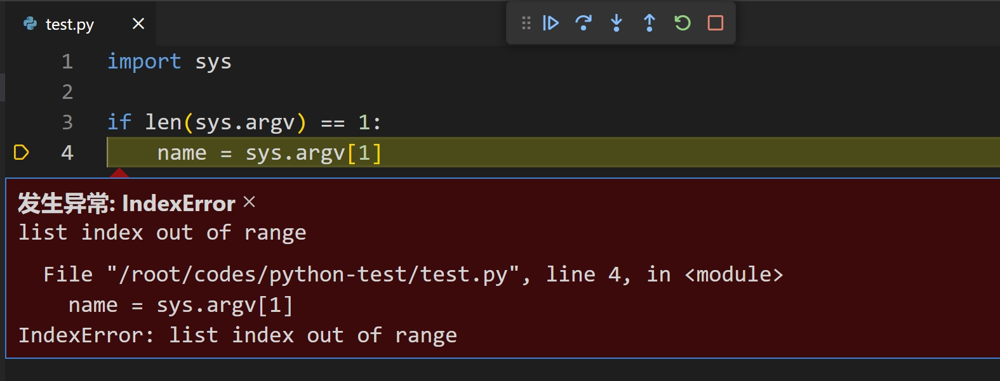
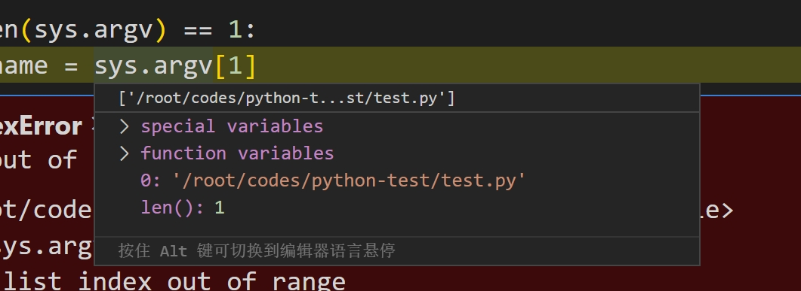
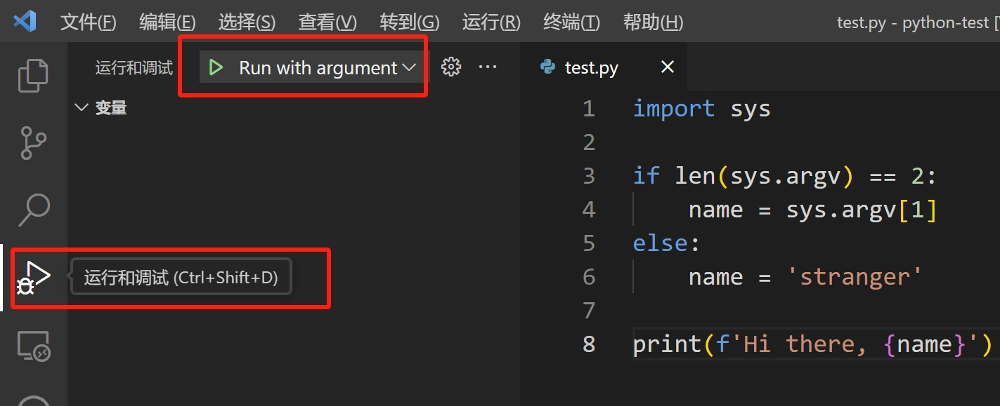
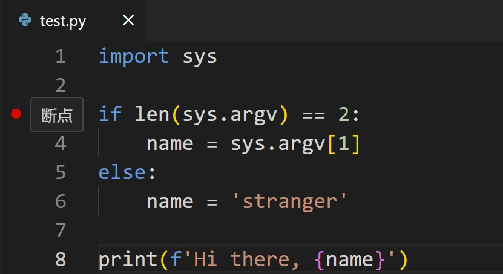

# VSCode 中的 Python：运行和调试<!-- omit in toc -->

- [1. 在 VSCode 中运行 Python](#1-在-vscode-中运行-python)
- [2. 在 VSCode 中调试 Python](#2-在-vscode-中调试-python)
  - [2.1. 调试当前文件](#21-调试当前文件)
  - [2.2. 创建运行配置](#22-创建运行配置)
  - [2.3. 断点](#23-断点)
- [3. 运行选择的代码或当前行](#3-运行选择的代码或当前行)
- [4. 从终端运行代码](#4-从终端运行代码)

## 1. 在 VSCode 中运行 Python

首先需要选择 python 解释器： 打开命令面板，“Control + shift + P”（Windows/Linux）或 “cmd + shift + P”（MacOS）。输入 “Python: select interpreter”，选择列出的 Python 版本。VSCode 通常会尽力自动检测可用的 Python 解释器，如果没有可选项，请确保已经安装了 Python，或选择手动输入解释器的路径。

配置解释器后，即可运行 Python 程序。创建一个新文件如 `test.py`，写入以下内容：

```Python
import sys

if len(sys.argv) == 1:
    name = sys.argv[1]
else:
    name = 'stranger'

print(f'Hi there, {name}')
```

然后运行此文件： 使用菜单 “运行 -> 以非调试模式运行”，也可以按 Control + F5（Windows/Linux）或 cmd + F5（MacOS）。接下来发生的是 VSCode 打开一个集成终端窗口，文件在其中运行。由于上述代码故意犯了一个错误，所以会收到类似以下内容的错误：

```
Traceback (most recent call last):
  File "/root/codes/python-test/test.py", line 4, in <module>
    name = sys.argv[1]
IndexError: list index out of range
```

## 2. 在 VSCode 中调试 Python

### 2.1. 调试当前文件

选择 “运行 -> 启动调试” 选项，或者直接按 F5，VSCode 会询问您要做什么。因为我们要运行当前文件，所以选择 “Python 文件”。程序将再次因错误而崩溃，但调试器不会停止，而是进入并突出显示发生错误的行：



当鼠标悬停在 `sys.argv` 文本上时，将看到一个弹出窗口，允许详细检查变量：



可以看出，即使我们没有提供参数，argv 仍然包含一个元素：当前脚本的完整路径。操作系统总是将程序的名称作为 argv 中的第一个参数提供给我们。

将代码更改为：if len(sys.argv) == 2。按右上角的重新启动按钮或按 Control + Shift + F5 或 cmd + shift + F5 重新启动程序。它现在应该输出 “Hi there, stranger” 并正常退出。

### 2.2. 创建运行配置

如果想要更多选项，可以创建一个或多个运行配置。这样的配置允许存储特定参数，因此可以按照我们想要的方式启动程序。

请单击 “运行 -> 添加配置”，再次选择 “Python 文件” 选项。VSCode 将在 `.vscode` 文件夹中创建一个 `launch.json` 文件。此文件预填充了示例配置。修改 JSON 使其如下所示，此配置为脚本提供了一个参数 “Erik”，请注意，它还专门启动 test.py 而不是当前文件：

```json
{
    "version": "0.2.0",
    "configurations": [
        {
            "name": "Run with argument",
            "type": "debugpy",
            "request": "launch",
            "program": "test.py",
            "console": "integratedTerminal",
            "args": ["Erik"]
        }
    ]
}
```

现在可以使用此配置启动调试器。但首先，通过单击带有小虫子的运行按钮或按下 Ctrl+Shift+D 或 Cmd+Shift+D 打开左侧面板中的运行/调试视图：



在此视图的顶部，您应该会看到新创建的配置。单击旁边的播放按钮启动它。现在应该输出 “Hi there, Erik”。

### 2.3. 断点

在某些时候，您需要使用断点：程序中的一行，您希望在该行明确暂停执行或休息一下，以便您有机会检查程序在该点的状态。

添加断点非常简单。左边距是一个通常称为装订线的区域。这是文件左侧显示行号的空间。当您将鼠标悬停在那里时，应该会出现一个淡淡的红点，单击它后，它会变成鲜红色：



如果现在运行该程序，程序会在断点处暂停，这样你就可以检查当时的变量。要继续，你可以点击继续按钮或按 F5。调试器将继续执行，直到遇到另一个断点或程序完成。

或者，您可以从这里开始使用 “step over”（F10）、“step into”（F11）和 “step out”（F12）按钮逐步执行程序。这样，您可以逐行执行程序，并可选择进入和退出 Python 函数调用：

-   “step over”（F10）： 在此行上运行命令。如果是函数调用，则运行整个函数，而不是“步入”并逐行运行该函数。
-   “step into”（F11）： 跟踪（或步入）函数调用并逐行运行该函数。
-   “step out”（F12）： 运行函数至结束，并返回到调用该函数之后的点。

## 3. 运行选择的代码或当前行

要运行选择的代码或当前行，请按 Shift+Enter 或使用命令面板并搜索 “Python: 在 Python 字段中运行选择/行”。

代码将在 Python REPL 中运行，一旦完成，此 REPL 保持打开状态，以便可以进行实验、检查变量等。且所有运行选择或当前行的后续命令都在同一 REPL 中执行，保持状态不变。因此，如果 “运行” 一个函数，那么现在可以从 REPL 调用该函数。如果更改函数并再次 “运行” 它，该函数将在 REPL 中重新定义。

## 4. 从终端运行代码

VSCode 有一个集成终端，非常有用。在很多情况下，使用终端比使用 GUI 更方便。例如：使用命令行选项进行测试时，可以在运行配置文件中添加选项，但如果这些选项不断变化，使用终端会更快。

打开终端可以使用命令面板运行 “终端：创建新的终端”，或使用快捷键 Ctrl+Shift+\`。接下来，像运行其他文件一样运行 Python 文件：

```shell
$ python3 test.py Erik
```
