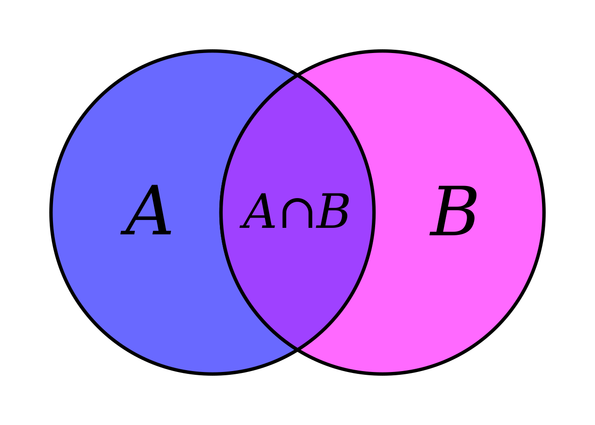

# Python 集合：为什么以及如何使用<!-- omit in toc -->

- [1. 如何创建 Python 集合](#1-如何创建-python-集合)
- [2. 集合和列表](#2-集合和列表)
- [3. Python 集合运算](#3-python-集合运算)
  - [3.1. 查找 Python 集合之间的差异](#31-查找-python-集合之间的差异)
  - [3.2. 查找 Python 集合之间的对称差异](#32-查找-python-集合之间的对称差异)
  - [3.3. 查找两个 Python 集合的交集](#33-查找两个-python-集合的交集)
  - [3.4. 子集和超集](#34-子集和超集)
  - [3.5. 真子集和超集](#35-真子集和超集)
  - [3.6. 并集](#36-并集)
- [4. Python 冻结集](#4-python-冻结集)
- [5. 所有 Python 集合运算](#5-所有-python-集合运算)

## 1. 如何创建 Python 集合

根据具体情况，有几种方法可以创建 Python 集合。要从头开始创建集合并直接向其中添加一些元素，可以使用花括号：

```py
>>> names = { "Eric", "Ali", "John" }
>>> names
{'John', 'Eric', 'Ali'}

>>> mixed_set = { 'a', 1, (1, 2) }
>>> mixed_set
{1, 'a', (1, 2)}
```

要创建空集，可以使用 `set()` 函数：

```py
my_set = set()
```

可以使用集合对象上的 `add` 方法将元素添加到集合中。如果要一次添加多个元素，则需要使用 `update` 方法并提供可迭代对象，例如 list、range 或 tuple：

```py
>>> my_set = set()
>>> my_set.add(1)
>>> my_set.add('Erik')
>>> my_set
{1, 'Erik'}

>>> my_set.update([3,4,5])
>>> my_set.update((6,7))
>>> my_set
{1, 3, 4, 5, 6, 7, 'Erik'}
```

还可以使用该 `set()` 函数将任何可迭代对象转换为集合：

```py
print( set([1, 2, 3]) )
# {1, 2, 3}
print( set(range(3)) )
# {0, 1, 2}
```

## 2. 集合和列表

集合仅包含唯一元素，我们可以通过为 `set()` 函数提供列表来创建集合。重复数据删除是删除重复项的过程，将列表转换为集合是迄今为止在 Python 中执行此操作的最简单方法：

```py
my_list = [1, 1, 1, 2, 3, 4, 4, 4, 4, 2, 2, 2]
my_set = set(my_list)
print(my_set)
# {1, 2, 3, 4}
```

要将集合转换为列表，只需创建一个以集合作为参数的新列表：

```py
A = { 1, 2, 3 }
my_list = list(A)
print(my_list)
#  [1, 2, 3]
```

## 3. Python 集合运算

两组集合的维恩图：



### 3.1. 查找 Python 集合之间的差异

让我们定义两个集合 A 和 B，并找出它们之间的差异。两个集合之间的差异是什么？查看维恩图时，我们想要找到仅存在于 A 中的元素。换句话说，我们想要摆脱任何也存在于 B 中的重叠元素。或者，更具体地说：我们想要所有存在于 A 但不存在于 A ∩ B 中的元素。

我们可以使用减法运算符来实现：

```py
A = { 1, 2, 3, 4, 5 }
B = { 3, 4, 5, 6, 7 }

print(A-B)
#  {1, 2}

print(B-A)
# {6, 7}
```

### 3.2. 查找 Python 集合之间的对称差异

两个集合之间的对称差由集合 A 或集合 B 中的元素组成，但不同时存在于两者中。换句话说：A 中的所有元素加上 B 中的元素，减去 A ∩ B 部分。要找到对称差，我们可以使用 `^` 运算符：

```py
A = { 1, 2, 3, 4, 5 }
B = { 3, 4, 5, 6, 7 }

print(A^B)
#  {1, 2, 6, 7}
```

### 3.3. 查找两个 Python 集合的交集

交集是维恩图中标有 A ∩ B 的部分。交集由两个集合中都存在的元素组成。要找到交集，我们可以使用 `&` 运算符：

```py
A = { 1, 2, 3, 4, 5 }
B = { 3, 4, 5, 6, 7 }
print(A & B)
# {3, 4, 5}
```

### 3.4. 子集和超集

如果 A 是 B 的子集，则 A 的所有元素也存在于 B 中。但是，子集 A 可以小于集合 B，这意味着 B 中的某些元素可能不存在于 A 中。因此，如果 A 几乎完全重叠，但有一个元素不存在于 B 中，则它不是 B 的子集。我们可以使用小于运算符检查 A 是否是 B 的子集： `<`。

如果 B 是 A 的超集，则意味着 B 具有 A 的所有元素，但也可能具有额外的元素。我们可以使用大于运算符 `>` 来检查 B 是否是 A 的超集。

```py
A = { 1, 2, 3 }
B = { 1, 2, 3, 4, 5 }
C = { 1, 2, 3, 10 }

# A是B的子集吗
print(A < B)
# True

# C是B的子集吗?
print(C < B)
# False

# B是a的超集吗?
print(B > A)
# True

# B不是C的超集，因为C包含10
print(B > C)
# False

print(A < A)
# False

print(A <= A)
# True

print(A >= A)
# True
```

### 3.5. 真子集和超集

Python 区分 “子集”（在数学中，我们写作 ⊂），也称为真子集，以及 “子集或等于”（在数学中，我们写作 ⊆）。

< 和 > 运算符执行前者，即检查真子集。如果 A < B，则表示 A 是 B 的子集，而不是其本身（A != B）。如果要检查“子集或等于”，可以使用 <=。超集也是如此：使用 >=。

### 3.6. 并集

可以将两个 Python 集合相加，并且只保留唯一元素。这称为集合的并集。在数学中，并集的符号为 A ∪ B，但在 Python 中，我们必须使用管道运算符 `|` 来创建并集：

```py
A = { 1, 2, 3 }
B = { 3, 4, 5 }
print(A|B)
#  {1, 2, 3, 4, 5}
```

## 4. Python 冻结集

除了常规的可变集合，还有冻结集（frozenset）。这种数据类型与常规集合有何不同：它在创建后直接冻结，因此您无法从中添加或删除元素。但是，您可以混合使用 set 和 frozenset 类型：所有常规运算（例如并集和交集）都适用于 set 和的组合 frozenset。

frozenset 的优点在于它是可哈希的，这意味着你可以将它用作字典键，甚至可以用作另一个字典中的元素 set。

```py
>>> fs = frozenset({1, 2})
>>> fs.add(3)
Traceback (most recent call last):
  File "<stdin>", line 1, in <module>
AttributeError: 'frozenset' object has no attribute 'add'
```

## 5. 所有 Python 集合运算

| 名称         | 操作符示例 | 方法示例                    | 它能做什么                                                   |
| ------------ | ---------- | --------------------------- | ------------------------------------------------------------ |
| 并集         | `A \| B`   | `A.union(B)`                | 创建一个包含 A 和 B 的集合                                   |
| 交集         | `A ＆ B`   | `A.intersection(B)`         | 创建一个包含 A 和 B 之间共同元素的集合                       |
| 差集         | `A - B`    | `A.difference(B)`           | 创建一个包含不属于 B 的元素的集合                            |
| 对称差集     | `A ^ B`    | `A.symmetric_difference(B)` | 创建一个集合，其中包含 A 或 B 中的元素，但不同时存在于两者中 |
| 是超集吗？   | `A >= B`   | `A.issuperset(B)`           | 如果 B 中的每个元素都在 A 中，则返回 `True`                  |
| 是子集吗？   | `A <= B`   | `A.issubset(B)`             | 如果 A 中的每个元素都在 B 中，则返回 `True`                  |
| 是否不相交？ | 无         | `A.isdisjoint(B)`           | 如果 A 与 B 没有共同元素则返回 `True`                        |
| 是真超集吗？ | `A > B`    | 没有方法                    | 如果 A >= B 且 A != B，则为                                  |
| 是真子集吗？ | `A < B`    | 没有方法                    | 如果 A <= B 且 A != B，则为真                                |
